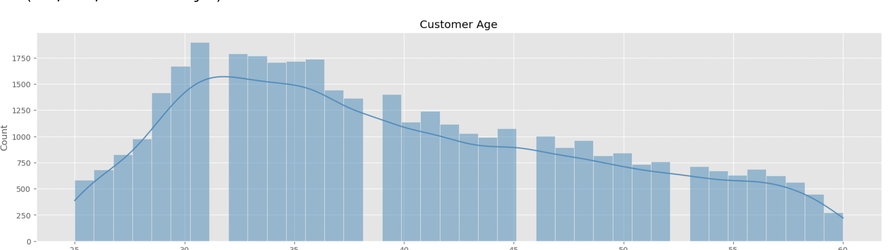
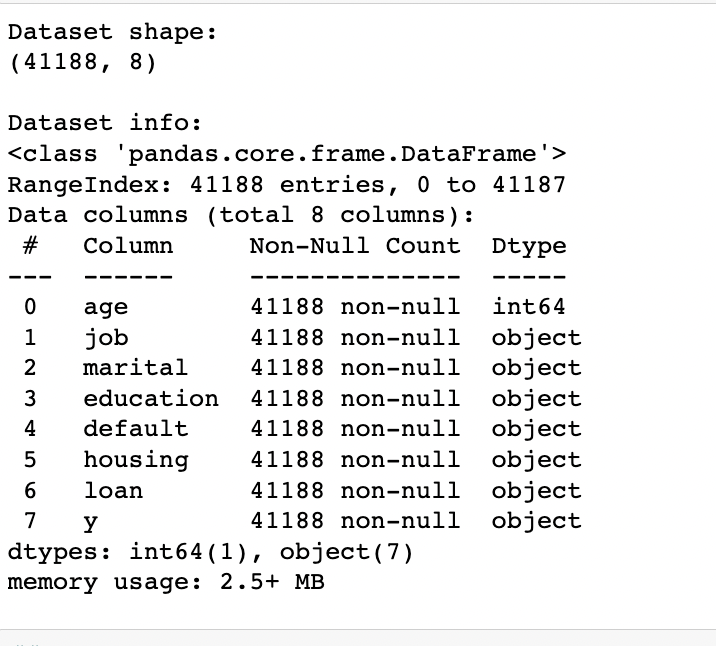
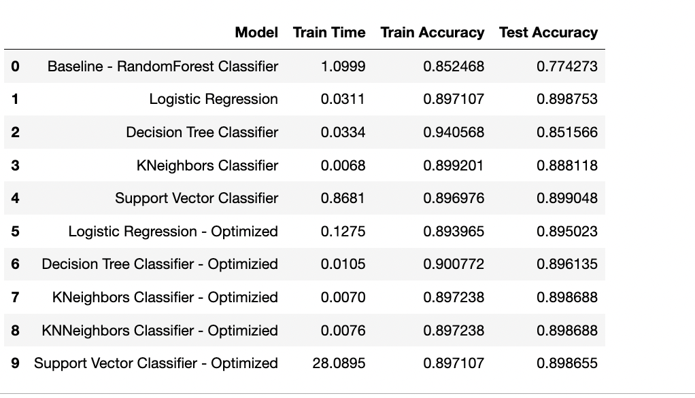

# CompareClassifiers

# Used Car analysis and price prediction
An analysis of used vehicle dataset containing 426880 samples to understand the various features and their correlations on the vehicle price. 

## Contents
- Business Summary
- Objective
- Data Understanding
- Data Preparation
- Modeling
- Evaluation
- Recommendations
- Conclusion
- Next steps

## Business Summary
A banking institute based in Portugal conducts a phone based marketing campaign calling to its existing customers to setup term deposit with the institute. After many marketing campaigns, the business realizes the success rate is 11% and there are many potential customers who can be targeted to open a term deposit account with the institute. Our business objective is to develop a best classifier model which can predict the group of customers to target during the marketing campaign. Limiting to features like customer's age,job,marital status,education,previous loan default,housing loan and personal loan, the objective is to develop an effective classifer so that the financial institute's marketing team can target their marketing effort with better success rate by identifying customers who have a high chance of signing up for term deposit with the financial institute.

## Objective
Analyze the bank's marketing data and their impact on customer creating a term deposit with respect to four different classifiers - LogisticRegression, DecisionTree,KNearestNeighbors and SVC classifier to analyze their accuracy and fit time. Further improve the classifiers by tunign various hyperparameters to see whether the performance can be improved. As a baseline classifier, use a RandomForest classifier, which has reduced accuracy due to many features.

## Data Understanding
Dataset contains 38,198 samples with 30 scaled features. On analyzing what the data can tell, vehicles older than 1980, priced less than 1000 and more than 125k is been purged from the dataset. Outliers are removed to avoid overfitting or underfitting issues.
Observations: 
  Majority of the customers called during marketing campaign are between 25 years to 60 years.
  Marital status of unknown found in 80 samples. They dont add value to our model and will drop from the sample set
  Majority of the customers do not have a credit in default
  The top three professions that our customers belong to are - administration, blue-collar jobs and technicians.
  2.4% of the samples do not have loan default status nor housing loan data. Dropping then as they might skew the model.
  More customers have housing loan but few have personal loan.
  Administrators, blue-collar and technician are the top 3 job types reached out during campaign
  Retiree have signed up more than any other category
  Customers between age 29 years to 38 years have signed up for term deposit
  Degree holders have signed up more
  Target variable shows an imbalance ratio of 89:11
  
  

## Data Preparation
Dummies encoded for object columns and scaled.

## Model
Scikit-learn classification models - RandomForest, LogisticRegression,DecisionTreeClassifier,KNearestNeighborClassifier,SVMClassifer and tuned for hyperparameters.

## Evaluation

## Recommendations
Pickup and SUV are command 60% higher price when compared to sedan
White and Black colored vehicles are lot more available than any other colors
Majority of the cars have put in less than 10k miles per year in 10 year range, thereby indicating that consumers are switching to newer vehicles. This gives an opportunity to source low odometer vehicles.
Average vehicle is about 10 - 12 years old, which might state that the vehicle can be used for another 10+ years
Sedan and SUV are the maxmimum vehicle types are available with clean title, automatic drive
Majority of the vehicles are automatic with very few manual shift. This indicates to source just the automatic transmission

## Conclusion
Close to 78% of the samples were discarded, thereby overfitting the model. Ridge regression model performed slightly better than linear or lasso. For the model to be effective, will need higher quality data. Using this, a recommendation model can be developed used salesmam to access high quality vehicles which can be sold faster. 

